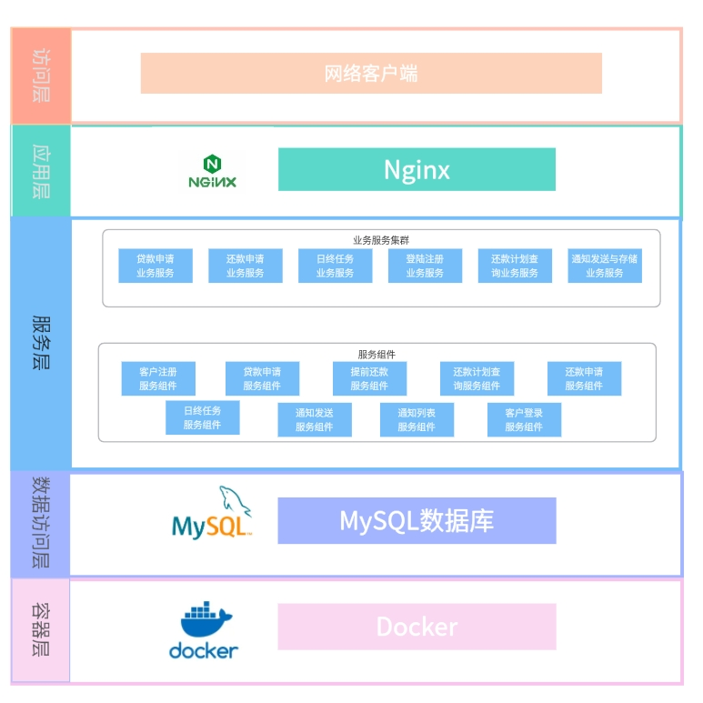
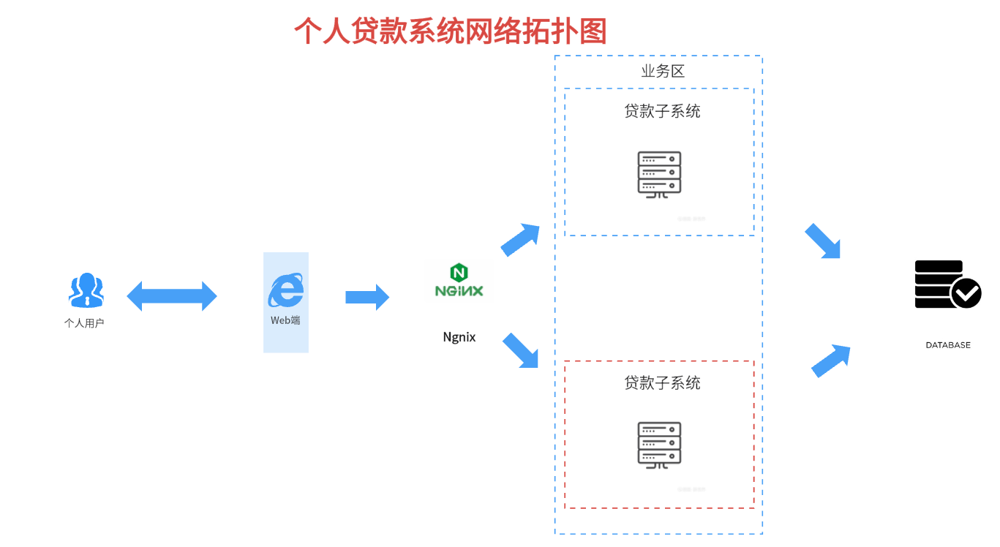
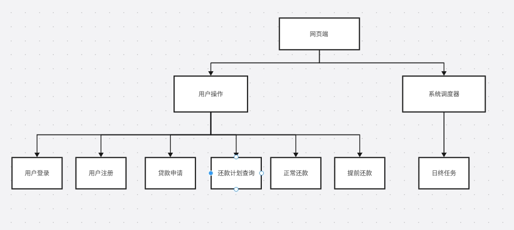
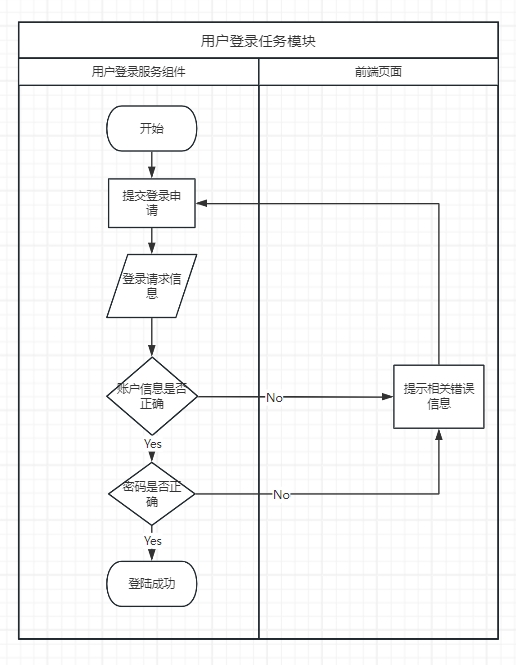
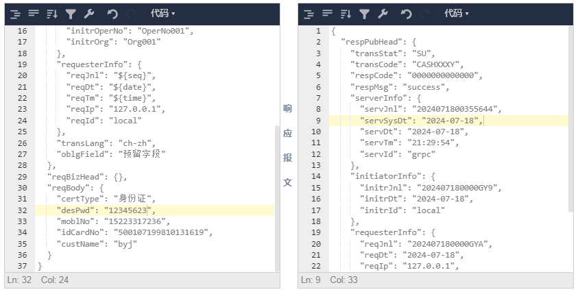
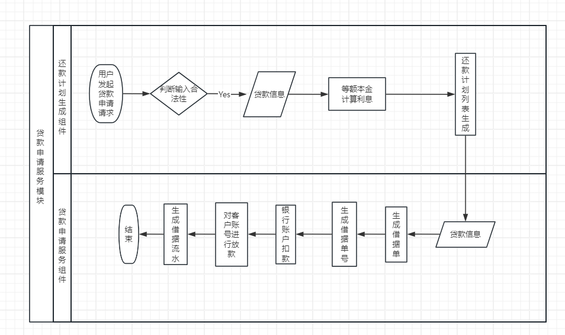
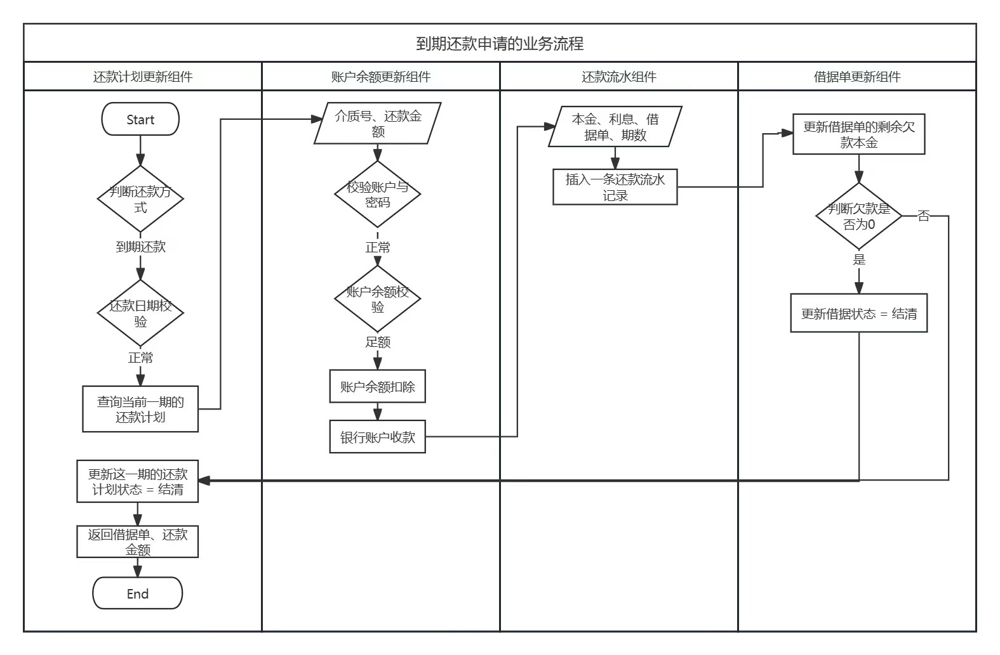
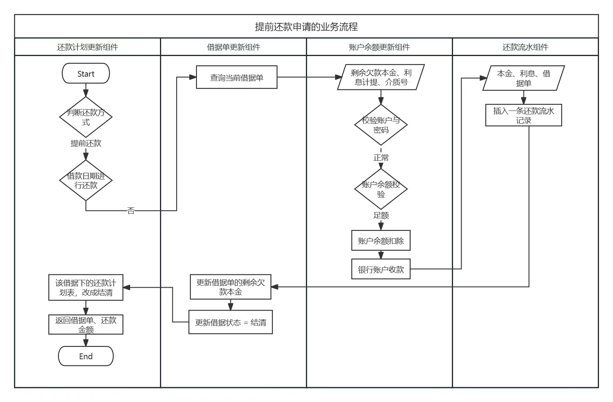
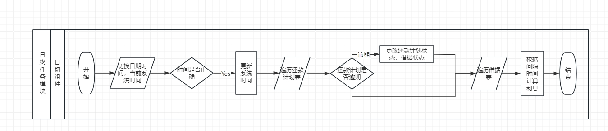

# 简易版个人贷款交易系统技术文档

## 1. 项目概述

### 1.1 项目名称
简易版个人贷款交易系统技术文档

### 1.2 项目背景

简易版个人贷款交易系统专注于贷款业务核心交易处理，旨在实现基本的贷款功能以满足业务需求。随着个人金融服务的数字化转型和用户对便捷贷款体验的需求增加，传统的贷款处理方法已经无法有效支持日益增长的个人贷款市场。本系统将利用现代化的技术手段，提供一个安全、高效的在线贷款交易平台，以满足借款人和贷款机构之间的实时交易需求。

### 1.3 项目目标

本项目旨在实现以下目标：
- 初步了解银行贷款相关的基本业务知识和概念。
- 掌握需求分析的流程，能够将产品需求转化为设计方案。
- 独立搭建微服务项目，利用行内微服务开发平台实现系统的核心功能。
- 掌握 Git 版本管理工具的使用，能够与团队协作开发。
- 提高文档编写能力，符合技术文档的编写模板和内容要求。
- 熟悉应用系统上线部署规范，为未来生产环境部署业务系统做好准备。
- 学习应用容器化标准规范，实践容器基础技术 Docker 的入门操作。

### 1.4 项目范围

项目将实现以下功能性和非功能性需求：
- **功能性需求**：支持贷款发放、还款管理、利息计算，银行日结和还款计划生成。系统应提供灵活的还款计划方式，包括等额本金和等额本息，并能生成详细的还款计划，以及提供多种还款方式，如正常还款，提前还款等，。
- **非功能性需求**：具备良好的性能和稳定性，能够处理高并发的交易请求并确保数据的完整性和安全性。提供友好的用户提示和错误信息，优化用户体验。具备可扩展性，支持新增功能和模块的集成，以适应未来业务的发展和变化。

## 2. 系统架构

### 2.1 应用架构图


### 2.2 网络架构图


## 3.贷款系统设计


### 3.1 系统设计


### 3.2 用户登录


### 3.3 用户注册


### 3.4 贷款申请


### 3.5 到期还款


### 3.6 提前还款申请


### 3.7 日终任务



## 4. 数据模型

### 4.1 数据字典

#### 4.1.1 PM_PAYC_NOTICE[通知存储表]

| 序号 | 字段编码    | 字段名称   | 字段类型 | 数据类型 | 数据长度 | 小数位数 | 是否为空 | 是否自增 | 默认值 | 创建时间           | 创建人   |
| ---- | ----------- | ---------- | -------- | -------- | -------- | -------- | -------- | -------- | ------ | ------------------ | -------- |
| 1    | advise_no   | 通知编号   | VARCHAR  | 字符串   | 50       |          | 否       | 否       |        | 2024-07-16 19:01:41 | zhubolun |
| 2    | acct_no     | 账号       | VARCHAR  | 字符串   | 40       |          | 否       | 否       |        | 2024-07-16 19:01:42 | zhubolun |
| 3    | type        | 类型       | VARCHAR  | 字符串   | 10       |          | 否       | 否       |        | 2024-07-16 19:01:42 | zhubolun |
| 4    | msg_contt   | 消息内容   | VARCHAR  | 字符串   | 512      |          | 否       | 否       |        | 2024-07-16 19:01:42 | zhubolun |
| 5    | advise_tm   | 通知时间   | VARCHAR  | 字符串   | 30       |          | 否       | 否       |        | 2024-07-16 19:01:42 | zhubolun |
| 6    | create_tm   | 创建时间戳 | DATETIME | 日期时间 |          |          | 是       | 否       |        | 2024-07-16 19:01:42 | zhubolun |
| 7    | modif_tm    | 变更时间戳 | DATETIME | 日期时间 |          |          | 是       | 否       |        | 2024-07-16 19:01:42 | zhubolun |

**索引**

| 序号 | 索引名称 | 索引类型 | 索引字段 | 创建时间           | 创建人   |
| ---- | -------- | -------- | -------- | ------------------ | -------- |
| 1    | PRIMARY  | 主键     | advise_no | 2024-07-16 19:01:42 | zhubolun |

#### 4.1.2 JN_PAYC_REPAY[还款流水表]

| 序号 | 字段编码      | 字段名称     | 字段类型 | 数据类型 | 数据长度 | 小数位数 | 是否为空 | 是否自增 | 默认值 | 创建时间           | 创建人   |
| ---- | ------------- | ------------ | -------- | -------- | -------- | -------- | -------- | -------- | ------ | ------------------ | -------- |
| 1    | seq_no        | 顺序号       | INT      | 整型     |          |          | 否       | 否       |        | 2024-07-16 19:02:09 | zhubolun |
| 2    | repay_srl_no  | 还款流水号   | VARCHAR  | 字符串   | 45       |          | 否       | 否       |        | 2024-07-16 19:02:09 | zhubolun |
| 3    | bill_no       | 借据号       | VARCHAR  | 字符串   | 30       |          | 否       | 否       |        | 2024-07-16 19:02:09 | zhubolun |
| 4    | acct_no       | 账号         | VARCHAR  | 字符串   | 40       |          | 否       | 否       |        | 2024-07-16 19:02:09 | zhubolun |
| 5    | med_no        | 介质号       | VARCHAR  | 字符串   | 50       |          | 否       | 否       |        | 2024-07-16 19:02:09 | zhubolun |
| 6    | repay_amt     | 还款金额     | DECIMAL  | 数值     | 18       | 2        | 否       | 否       |        | 2024-07-16 19:02:09 | zhubolun |
| 7    | ccy_shd_pay_prin | 本期应还本金 | DECIMAL  | 数值     | 18       | 2        | 否       | 否       |        | 2024-07-16 19:02:09 | zhubolun |
| 8    | ccy_shd_pay_int  | 本期应还利息 | DECIMAL  | 数值     | 18       | 2        | 否       | 否       |        | 2024-07-16 19:02:09 | zhubolun |
| 9    | ccy_terms     | 本期期数     | INT      | 整型     |          |          | 否       | 否       |        | 2024-07-16 19:02:09 | zhubolun |
| 10   | create_dt     | 创建日期     | DATE     | 日期     |          |          | 否       | 否       |        | 2024-07-16 19:02:09 | zhubolun |
| 11   | create_tm     | 创建时间戳   | DATETIME | 日期时间 |          |          | 是       | 否       |        | 2024-07-16 19:02:09 | zhubolun |
| 12   | modif_tm      | 变更时间戳   | DATETIME | 日期时间 |          |          | 是       | 否       |        | 2024-07-16 19:02:09 | zhubolun |

**索引**

| 序号 | 索引名称            | 索引类型 | 索引字段    | 创建时间           | 创建人   |
| ---- | ------------------- | -------- | ----------- | ------------------ | -------- |
| 1    | PRIMARY             | 主键     | seq_no      | 2024-07-16 19:02:09 | zhubolun |
| 2    | UNI_JN_PAYC_REPAY_1 | 唯一索引 | repay_srl_no | 2024-07-16 19:02:09 | zhubolun |

#### 4.1.3 JN_PAYC_LOAN[放贷流水表]

| 序号 | 字段编码  | 字段名称   | 字段类型 | 数据类型 | 数据长度 | 小数位数 | 是否为空 | 是否自增 | 默认值 | 创建时间           | 创建人   |
| ---- | --------- | ---------- | -------- | -------- | -------- | -------- | -------- | -------- | ------ | ------------------ | -------- |
| 1    | seq_no    | 顺序号     | INT      | 整型     |          |          | 否       | 否       |        | 2024-07-16 19:02:40 | zhubolun |
| 2    | srl_no    | 流水号     | VARCHAR  | 字符串   | 45       |          | 否       | 否       |        | 2024-07-16 19:02:40 | zhubolun |
| 3    | acct_no   | 账号       | VARCHAR  | 字符串   | 40       |          | 否       | 否       |        | 2024-07-16 19:02:40 | zhubolun |
| 4    | med_no    | 介质号     | VARCHAR  | 字符串   | 50       |          | 否       | 否       |        | 2024-07-16 19:02:40 | zhubolun |
| 5    | loan_amt  | 贷款金额   | DECIMAL  | 数值     | 18       | 2        | 否       | 否       |        | 2024-07-16 19:02:40 | zhubolun |
| 6    | prod_cd   | 产品代码   | VARCHAR  | 字符串   | 20       |          | 否       | 否       |        | 2024-07-16 19:02:40 | zhubolun |
| 7    | create_dt | 创建日期   | DATE     | 日期     |          |          | 否       | 否       |        | 2024-07-16 19:02:40 | zhubolun |
| 8    | loan_status | 贷款状态 | VARCHAR  | 字符串   | 10       |          | 是       | 否       |        | 2024-07-16 19:02:40 | zhubolun |
| 9    | operr_no  | 操作员编号 | VARCHAR  | 字符串   | 16       |          | 是       | 否       |        | 2024-07-16 19:02:40 | zhubolun |
| 10   | create_tm | 创建时间戳 | DATETIME | 日期时间 |          |          | 是       | 否       |        | 2024-07-16 19:02:40 | zhubolun |
| 11   | modif_tm  | 变更时间戳 | DATETIME | 日期时间 |          |          | 是       | 否       |        | 2024-07-16 19:02:40 | zhubolun |

**索引**

| 序号 | 索引名称          | 索引类型 | 索引字段 | 创建时间           | 创建人   |
| ---- | ----------------- | -------- | -------- | ------------------ | -------- |
| 1    | PRIMARY           | 主键     | seq_no   | 2024-07-16 19:02:41 | zhubolun |
| 2    | UNI_JN_PAYC_LOAN_1 | 唯一索引 | srl_no   | 2024-07-16 19:02:41 | zhubolun |

#### 4.1.4 BS_PAYC_MED[介质表]

| 序号 | 字段编码   | 字段名称 | 字段类型 | 数据类型 | 数据长度 | 小数位数 | 是否为空 | 是否自增 | 默认值 | 创建时间           | 创建人   |
| ---- | ---------- | -------- | -------- | -------- | -------- | -------- | -------- | -------- | ------ | ------------------ | -------- |
| 1    | seq_no     | 顺序号   | INT      | 整型     |          |          | 否       | 否       |        | 2024-07-16 19:48:54 | zhusiju  |
| 2    | med_no     | 介质号   | VARCHAR  | 字符串   | 50       |          | 否       | 否       |        | 2024-07-16 19:48:54 | zhusiju  |
| 3    | acct_no    | 账号     | VARCHAR  | 字符串   | 40       |          | 否       | 否       |        | 2024-07-16 19:48:54 | zhusiju  |
| 4    | trans_pwd  | 交易密码 | VARCHAR  | 字符串   | 256      |          | 是       | 否       |        | 2024-07-16 19:48:54 | zhusiju  |
| 5    | bal        | 余额     | DECIMAL  | 数值     | 18       | 2        | 否       | 否       |        | 2024-07-16 19:48:54 | zhusiju  |
| 6    | rgst_dt    | 登记日期 | DATE     | 日期     |          |          | 否       | 否       |        | 2024-07-16 19:48:54 | zhusiju  |
| 7    | create_tm  | 创建时间戳 | DATETIME | 日期时间 |          |          | 是       | 否       |        | 2024-07-16 19:48:54 | zhusiju  |
| 8    | modif_tm   | 变更时间戳 | DATETIME | 日期时间 |          |          | 是       | 否       |        | 2024-07-16 19:48:54 | zhusiju  |
| 9    | version    | 版本号   | INT      | 整型     |          |          | 否       | 否       |        | 2024-07-16 19:48:54 | zhusiju  |

**索引**

| 序号 | 索引名称           | 索引类型 | 索引字段 | 创建时间           | 创建人  |
| ---- | ------------------ | -------- | -------- | ------------------ | ------- |
| 1    | IDX_BS_PAYC_MED_2  | 普通索引 | version  | 2024-07-16 19:48:54 | zhusiju |
| 2    | PRIMARY            | 主键     | seq_no   | 2024-07-16 19:48:54 | zhusiju |
| 3    | UNI_BS_PAYC_MED_1  | 唯一索引 | med_no   | 2024-07-16 19:48:54 | zhusiju |

#### 4.1.5 PM_PAYC_ACC_INFO[账户表]

| 序号 | 字段编码   | 字段名称 | 字段类型 | 数据类型 | 数据长度 | 小数位数 | 是否为空 | 是否自增 | 默认值 | 创建时间           | 创建人   |
| ---- | ---------- | -------- | -------- | -------- | -------- | -------- | -------- | -------- | ------ | ------------------ | -------- |
| 1    | seq_no     | 顺序号   | INT      | 整型     |          |          | 否       | 否       |        | 2024-07-16 19:03:47 | zhubolun |
| 2    | acct_no    | 账号     | VARCHAR  | 字符串   | 40       |          | 否       | 否       |        | 2024-07-16 19:03:47 | zhubolun |
| 3    | user_no    | 用户编号 | VARCHAR  | 字符串   | 50       |          | 否       | 否       |        | 2024-07-16 19:03:47 | zhubolun |
| 4    | cust_name  | 客户名称 | VARCHAR  | 字符串   | 200      |          | 否       | 否       |        | 2024-07-16 19:03:47 | zhubolun |
| 5    | cert_type  | 证件类型 | VARCHAR  | 字符串   | 5        |          | 否       | 否       |        | 2024-07-16 19:03:47 | zhubolun |
| 6    | id_card_no | 身份证号 | VARCHAR  | 字符串   | 50       |          | 否       | 否       |        | 2024-07-16 19:03:47 | zhubolun |
| 7    | create_dt  | 创建日期 | DATE     | 日期     |          |          | 否       | 否       |        | 2024-07-16 19:03:47 | zhubolun |
| 8    | create_tm  | 创建时间戳 | DATETIME | 日期时间 |          |          | 是       | 否       |        | 2024-07-16 19:03:47 | zhubolun |
| 9    | modif_tm   | 变更时间戳 | DATETIME | 日期时间 |          |          | 是       | 否       |        | 2024-07-16 19:03:47 | zhubolun |

**索引**

| 序号 | 索引名称              | 索引类型 | 索引字段 | 创建时间           | 创建人   |
| ---- | --------------------- | -------- | -------- | ------------------ | -------- |
| 1    | PRIMARY               | 主键     | seq_no   | 2024-07-16 19:03:47 | zhubolun |
| 2    | UNI_PM_PAYC_ACC_INFO_1 | 唯一索引 | acct_no  | 2024-07-16 19:03:47 | zhubolun |

#### 4.1.6 PM_PAYC_SYS_DATE[系统日切表]

| 序号 | 字段编码 | 字段名称 | 字段类型 | 数据类型 | 数据长度 | 小数位数 | 是否为空 | 是否自增 | 默认值 | 创建时间           | 创建人   |
| ---- | -------- | -------- | -------- | -------- | -------- | -------- | -------- | -------- | ------ | ------------------ | -------- |
| 1    | seq_no   | 顺序号   | INT      | 整型     |          |          | 否       | 否       |        | 2024-07-16 19:04:12 | zhubolun |
| 2    | dt_cd    | 日期编码 | VARCHAR  | 字符串   | 30       |          | 否       | 否       |        | 2024-07-16 19:04:12 | zhubolun |
| 3    | sys_dt   | 系统日期 | DATE     | 日期     |          |          | 否       | 否       |        | 2024-07-16 19:04:12 | zhubolun |
| 4    | create_tm | 创建时间戳 | DATETIME | 日期时间 |          |          | 是       | 否       |        | 2024-07-16 19:04:12 | zhubolun |
| 5    | modif_tm | 变更时间戳 | DATETIME | 日期时间 |          |          | 是       | 否       |        | 2024-07-16 19:04:12 | zhubolun |

**索引**

| 序号 | 索引名称 | 索引类型 | 索引字段 | 创建时间           | 创建人   |
| ---- | -------- | -------- | -------- | ------------------ | -------- |
| 1    | PRIMARY  | 主键     | seq_no   | 2024-07-16 19:04:12 | zhubolun |

#### 4.1.7 BS_PAYC_REPAY_PLAN[还款计划表]

| 序号 | 字段编码               | 字段名称         | 字段类型  | 数据类型 | 数据长度 | 小数位数 | 是否为空 | 是否自增 | 默认值 | 创建时间           | 创建人   |
| ---- | ---------------------- | ---------------- | -------- | -------- | -------- | -------- | -------- | -------- | ------ | ------------------ | -------- |
| 1    | seq_no                 | 顺序号             | INT      | 整型     |          |          | 否       | 否       |        | 2024-07-16 19:05:52 | zhubolun  |
| 2    | repay_plan_no          | 还款计划编号       | VARCHAR  | 字符串   | 20       |          | 否       | 否       |        | 2024-07-16 19:05:52 | zhubolun  |
| 3    | bill_no                | 借据号             | VARCHAR  | 字符串   | 30       |          | 否       | 否       |        | 2024-07-16 19:05:52 | zhubolun  |
| 4    | total_terms            | 总期数             | INT      | 整型     |          |          | 否       | 否       |        | 2024-07-16 19:05:52 | zhubolun  |
| 5    | issue                  | 当前期次           | INT      | 整型     |          |          | 否       | 否       |        | 2024-07-16 19:05:52 | zhubolun  |
| 6    | biz_status             | 业务状态           | VARCHAR  | 字符串   | 10       |          | 否       | 否       |        | 2024-07-16 19:05:52 | zhubolun  |
| 7    | start_dt               | 开始日期           | DATE     | 日期     |          |          | 否       | 否       |        | 2024-07-16 19:05:52 | zhubolun  |
| 8    | shd_pay_date           | 应还日期           | DATE     | 日期     |          |          | 否       | 否       |        | 2024-07-16 19:05:52 | zhubolun  |
| 9    | shd_pay_prin           | 应还本金           | DECIMAL  | 数值     | 18       | 2        | 否       | 否       |        | 2024-07-16 19:05:52 | zhubolun  |
| 10   | shd_pay_int            | 应还利息           | DECIMAL  | 数值     | 18       | 2        | 否       | 否       |        | 2024-07-16 19:05:52 | zhubolun  |
| 11   | total_shd_pay_money_amt| 总应还款金额       | DECIMAL  | 数值     | 18       | 2        | 否       | 否       |        | 2024-07-16 19:05:52 | zhubolun  |
| 12   | pay_prin_sum_amt       | 应还本金合计金额   | DECIMAL  | 数值     | 18       | 2        | 否       | 否       |        | 2024-07-16 19:05:52 | zhubolun  |
| 13   | remain_prin            | 剩余本金           | DECIMAL  | 数值     | 18       | 2        | 否       | 否       |        | 2024-07-16 19:05:52 | zhubolun  |
| 14   | remain_int             | 剩余利息           | DECIMAL  | 数值     | 18       | 2        | 否       | 否       |        | 2024-07-16 19:05:52 | zhubolun  |
| 15   | create_tm              | 创建时间戳         | DATETIME | 日期时间 |          |          | 是       | 否       |        | 2024-07-16 19:05:52 | zhubolun  |
| 16   | modif_tm               | 变更时间戳         | DATETIME | 日期时间 |          |          | 是       | 否       |        | 2024-07-16 19:05:52 | zhubolun  |

**索引**

| 序号 | 索引名称                   | 索引类型 | 索引字段     | 创建时间           | 创建人   |
| ---- | -------------------------- | -------- | ------------ | ------------------ | -------- |
| 1    | IDX_BS_PAYC_REPAY_PLAN_1   | 普通索引 | billNo       | 2024-07-16 19:05:52 | zhubolun  |
| 2    | PRIMARY                    | 主键     | seqNo        | 2024-07-16 19:05:52 | zhubolun  |
| 3    | UNI_BS_PAYC_REPAY_PLAN_2   | 唯一索引 | repayPlanNo  | 2024-07-16 19:05:52 | zhubolun  |

#### 4.1.8 BS_PAYC_PRODINFO[产品表]

| 序号 | 字段编码        | 字段名称       | 字段类型 | 数据类型 | 数据长度 | 小数位数 | 是否为空 | 是否自增 | 默认值 | 创建时间           | 创建人   |
| ---- | --------------- | -------------- | -------- | -------- | -------- | -------- | -------- | -------- | ------ | ------------------ | -------- |
| 1    | seq_no          | 顺序号         | INT      | 整型     |          |          | 否       | 否       |        | 2024-07-16 19:06:13 | zhubolun |
| 2    | prod_no         | 产品编号       | VARCHAR  | 字符串   | 50       |          | 否       | 否       |        | 2024-07-16 19:06:13 | zhubolun |
| 3    | prod_name       | 产品名称       | VARCHAR  | 字符串   | 200      |          | 否       | 否       |        | 2024-07-16 19:06:13 | zhubolun |
| 4    | prod_type       | 产品类型       | VARCHAR  | 字符串   | 10       |          | 否       | 否       |        | 2024-07-16 19:06:13 | zhubolun |
| 5    | yr_int_rate     | 年利率         | DECIMAL  | 数值     | 26       | 10       | 否       | 否       |        | 2024-07-16 19:06:13 | zhubolun |
| 6    | loan_term       | 贷款期限       | INT      | 整型     |          |          | 否       | 否       |        | 2024-07-16 19:06:13 | zhubolun |
| 7    | repay_type      | 还款方式       | VARCHAR  | 字符串   | 10       |          | 否       | 否       |        | 2024-07-16 19:06:13 | zhubolun |
| 8    | repay_dt        | 还款日期       | DATE     | 日期     |          |          | 否       | 否       |        | 2024-07-16 19:06:13 | zhubolun |
| 9    | adv_repay_flag  | 提前还款标志   | VARCHAR  | 字符串   | 2        |          | 否       | 否       |        | 2024-07-16 19:06:13 | zhubolun |
| 10   | create_tm       | 创建时间戳     | DATETIME | 日期时间 |          |          | 是       | 否       |        | 2024-07-16 19:06:13 | zhubolun |
| 11   | modif_tm        | 变更时间戳     | DATETIME | 日期时间 |          |          | 是       | 否       |        | 2024-07-16 19:06:13 | zhubolun |

**索引**

| 序号 | 索引名称                | 索引类型  | 索引字段 | 创建时间           | 创建人   |
| ---- | ----------------------- | --------- | -------- | ------------------ | -------- |
| 1    | PRIMARY                 | 主键      | seqNo    | 2024-07-16 19:06:13 | zhubolun |
| 2    | UNI_BS_PAYC_PRODINFO_1  | 唯一索引  | prodNo   | 2024-07-16 19:06:13 | zhubolun |

#### 4.1.9 BS_PAYC_RECEIPT[借据表]

| 序号 | 字段编码         | 字段名称           | 字段类型  | 数据类型 | 数据长度 | 小数位数 | 是否为空 | 是否自增 | 默认值 | 创建时间           | 创建人   |
| ---- | ---------------- | ------------------ | -------- | -------- | -------- | -------- | -------- | -------- | ------ | ------------------ | -------- |
| 1    | seq_no           | 顺序号             | INT      | 整型     |          |          | 否       | 否       |        | 2024-07-16 20:30:47 | zhusiju  |
| 2    | bill_no          | 借据号             | VARCHAR  | 字符串   | 30       |          | 否       | 否       |        | 2024-07-16 20:30:47 | zhusiju  |
| 3    | brwr_cust_no     | 借款人客户号       | VARCHAR  | 字符串   | 18       |          | 否       | 否       |        | 2024-07-16 20:30:47 | zhusiju  |
| 4    | prod_no          | 产品编号           | VARCHAR  | 字符串   | 50       |          | 否       | 否       |        | 2024-07-16 20:30:47 | zhusiju  |
| 5    | prod_name        | 产品名称           | VARCHAR  | 字符串   | 200      |          | 否       | 否       |        | 2024-07-16 20:30:48 | zhusiju  |
| 6    | acc_loan         | 放款账户           | VARCHAR  | 字符串   | 50       |          | 否       | 否       |        | 2024-07-16 20:30:48 | zhusiju  |
| 7    | total_amt        | 总金额             | DECIMAL  | 数值     | 18       | 2        | 否       | 否       |        | 2024-07-16 20:30:48 | zhusiju  |
| 8    | arrs_bal         | 欠款余额           | DECIMAL  | 数值     | 18       | 2        | 否       | 否       |        | 2024-07-16 20:30:48 | zhusiju  |
| 9    | prod_period_seq  | 产品期次           | INT      | 整型     |          |          | 否       | 否       |        | 2024-07-16 20:30:48 | zhusiju  |
| 10   | exec_int_rate    | 执行利率           | DECIMAL  | 数值     | 26       | 10       | 否       | 否       |        | 2024-07-16 20:30:48 | zhusiju  |
| 11   | repay_type       | 还款方式           | VARCHAR  | 字符串   | 10       |          | 否       | 否       |        | 2024-07-16 20:30:48 | zhusiju  |
| 12   | value_dt         | 起息日             | DATE     | 日期     |          |          | 否       | 否       |        | 2024-07-16 20:30:48 | zhusiju  |
| 13   | repay_dt         | 还款日期           | DATE     | 日期     |          |          | 否       | 否       |        | 2024-07-16 20:30:48 | zhusiju  |
| 14   | bill_status      | 借据状态           | VARCHAR  | 字符串   | 4        |          | 否       | 否       |        | 2024-07-16 20:30:48 | zhusiju  |
| 15   | int_provs_amt    | 利息计提金额       | DECIMAL  | 数值     | 26       | 10       | 否       | 否       |        | 2024-07-16 20:30:48 | zhusiju  |
| 16   | create_tm        | 创建时间戳         | DATETIME | 日期时间 |          |          | 是       | 否       |        | 2024-07-16 20:30:48 | zhusiju  |
| 17   | modif_tm         | 变更时间戳         | DATETIME | 日期时间 |          |          | 是       | 否       |        | 2024-07-16 20:30:48 | zhusiju  |
| 18   | version          | 版本号             | INT      | 整型     |          |          | 否       | 否       |        | 2024-07-16 20:30:48 | zhusiju  |

**索引**

| 序号 | 索引名称              | 索引类型 | 索引字段 | 创建时间           | 创建人   |
| ---- | --------------------- | -------- | -------- | ------------------ | -------- |
| 1    | PRIMARY               | 主键     | seqNo    | 2024-07-16 20:30:48 | zhusiju  |
| 2    | UNI_BS_PAYC_RECEIPT_1 | 唯一索引 | billNo   | 2024-07-16 20:30:48 | zhusiju  |

#### 4.1.10 BS_PAYC_USER_LOG[注册表]

| 序号 | 字段编码  | 字段名称   | 字段类型 | 数据类型 | 数据长度 | 小数位数 | 是否为空 | 是否自增 | 默认值 | 创建时间           | 创建人   |
| ---- | --------- | ---------- | -------- | -------- | -------- | -------- | -------- | -------- | ------ | ------------------ | -------- |
| 1    | seq_no    | 顺序号     | INT      | 整型     |          |          | 否       | 否       |        | 2024-07-16 19:06:44 | zhubolun |
| 2    | user_no   | 用户编号   | VARCHAR  | 字符串   | 50       |          | 否       | 否       |        | 2024-07-16 19:06:44 | zhubolun |
| 3    | mobl_no   | 手机号码   | VARCHAR  | 字符串   | 60       |          | 否       | 否       |        | 2024-07-16 19:06:44 | zhubolun |
| 4    | des_pwd   | des密码    | VARCHAR  | 字符串   | 128      |          | 否       | 否       |        | 2024-07-16 19:06:44 | zhubolun |
| 5    | ip_addr   | IP地址     | VARCHAR  | 字符串   | 60       |          | 是       | 否       |        | 2024-07-16 19:06:44 | zhubolun |
| 6    | create_tm | 创建时间戳 | DATETIME | 日期时间 |          |          | 是       | 否       |        | 2024-07-16 19:06:44 | zhubolun |
| 7    | modif_tm  | 变更时间戳 | DATETIME | 日期时间 |          |          | 是       | 否       |        | 2024-07-16 19:06:44 | zhubolun |

**索引**

| 序号 | 索引名称               | 索引类型  | 索引字段 | 创建时间           | 创建人   |
| ---- | ---------------------- | --------- | -------- | ------------------ | -------- |
| 1    | PRIMARY                | 主键      | seqNo    | 2024-07-16 19:06:44 | zhubolun |
| 2    | UNI_BS_PAYC_USER_LOG_1 | 唯一索引  | moblNo   | 2024-07-16 19:06:44 | zhubolun |

### 4.2 ER图
绘制实体关系图，展示数据表之间的关系。

### 4.3 数据库设计
描述数据库的设计原则和规范。

## 5. 接口设计

### 还款计划查询接口

**组件名称**  
还款计划查询

**组件编码**  
`SVCPAYC002`

**业务模块名称**  
支付模块3

**组件使用范围**  
模块内使用（范围代码：0）

**描述**  
提供用户查询具体的还款计划详情，包括每期的还款金额、日期等信息。

**请求URL**  
`http://158.58.17.53:8080/payc/PAY/ZPAYC70001/v1.0.0`

**请求方式**  
POST

**输入参数**

| 参数名 | 类型    | 必须 | 描述   | 数据长度 | 是否非空 | 示例值        |
|--------|---------|------|-------|---------|---------|--------------|
| billNo | string  | 是   | 借据号 | 30      | 是      | "1234567890" |

**输出参数**

| 参数名                | 类型     | 描述               | 数据长度 | 精度 | 是否非空 | 示例值    |
|-----------------------|----------|--------------------|---------|-----|---------|-----------|
| RepayPlanList         | list     | 还款计划列表       | -       | -   | 是      | 见详细结构 |
| errInfo               | string   | 错误信息           | 512     | -   | 是      | ""        |

**RepayPlanList 结构**

| 字段名                | 类型     | 描述               | 数据长度 | 精度 | 是否非空 | 示例值    |
|-----------------------|----------|--------------------|---------|-----|---------|-----------|
| repayPlanNo           | string   | 还款计划编号       | 20      | -   | 是      | "RP123"   |
| totalTerms            | int      | 总期数             | -       | -   | 是      | 12        |
| currTerms             | int      | 当前期次           | -       | -   | 是      | 1         |
| bizStatus             | string   | 业务状态           | 10      | -   | 是      | "正常"    |
| startDt               | date     | 开始日期           | -       | -   | 是      | "2024-01-01" |
| shdPayDate            | date     | 应还日期           | -       | -   | 是      | "2024-02-01" |
| shdPayPrin            | decimal  | 应还本金           | 18      | 2   | 是      | 1000.00   |
| shdPayInt             | decimal  | 应还利息           | 18      | 2   | 是      | 50.00     |
| totalShdPayMoneyAmt   | decimal  | 总应还款金额       | 18      | 2   | 是      | 1050.00   |
| remainPrin            | decimal  | 剩余本金           | 18      | 2   | 是      | 11000.00  |
| remainInt             | decimal  | 剩余利息           | 18      | 2   | 是      | 550.00    |

**示例请求**

```json
{
  "billNo": "1234567890"
}
```
**示例返回**

```json
{
  "RepayPlanList": [
    {
      "repayPlanNo": "RP123",
      "totalTerms": 12,
      "currTerms": 1,
      "bizStatus": "正常",
      "startDt": "2024-01-01",
      "shdPayDate": "2024-02-01",
      "shdPayPrin": 1000.00,
      "shdPayInt": 50.00,
      "totalShdPayMoneyAmt": 1050.00,
      "remainPrin": 11000.00,
      "remainInt": 550.00
    }
  ],
  "errInfo": ""
}

```

### 贷款申请接口

**组件名称**  
贷款申请

**组件编码**  
`SVCPAYC004`

**业务模块名称**  
支付模块3

**组件使用范围**  
模块内使用（范围代码：0）

**描述**  
提供用户提交贷款申请的服务，包括个人信息和贷款详细信息。

**请求URL**  
`http://158.58.17.53:8080/payc/PAY/ZPAYC30002/v1.0.0`

**请求方式**  
POST

**输入参数**

| 参数名          | 类型    | 必须 | 描述               | 数据长度 | 精度 | 是否非空 | 示例值         |
|-----------------|---------|------|--------------------|---------|------|----------|---------------|
| brwrCertNo      | string  | 是   | 借款人证件号       | 30      | -    | 否       | "1234567890"  |
| objProdCd       | string  | 是   | 对象产品代码       | 20      | -    | 否       | "PROD001"     |
| prodName        | string  | 是   | 产品名称           | 200     | -    | 否       | "个人贷款"    |
| accLoan         | string  | 是   | 账户贷款           | 50      | -    | 否       | "ACC12345"    |
| amt             | decimal | 是   | 金额               | 18      | 2    | 否       | 50000         |
| prodPeriodSeq   | int     | 是   | 产品期序           | -       | -    | 否       | 12            |
| execIntRate     | decimal | 是   | 执行利率           | 26      | 10   | 否       | 5.5           |
| repayType       | string  | 是   | 还款类型           | 10      | -    | 否       | "等额本金" |
| repayDt         | date    | 是   | 还款日期           | -       | -    | 否       | "2024-01-01"  |
| valueDt         | date    | 是   | 起息日             | -       | -    | 否       | "2023-12-01"  |

**输出参数**

| 参数名       | 类型    | 描述             | 数据长度 | 精度 | 是否非空 | 示例值       |
|--------------|---------|------------------|---------|------|----------|-------------|
| billNo       | string  | 账单号           | 30      | -    | 否       | "BILL12345" |
| transStat    | string  | 交易状态         | 20      | -    | 否       | "成功"       |

**示例请求**

```json
{
  "brwrCertNo": "1234567890",
  "objProdCd": "PROD001",
  "prodName": "个人贷款",
  "accLoan": "ACC12345",
  "amt": 50000,
  "prodPeriodSeq": 12,
  "execIntRate": 5.5,
  "repayType": "按月等额本息",
  "repayDt": "2024-01-01",
  "valueDt": "2023-12-01"
}
```

**示例返回**
```json
{
  "billNo": "BILL12345",
  "transStat": "成功"
}

```

### 还款申请接口

**组件名称**  
还款申请

**组件编码**  
`SVCPAYC006`

**业务模块名称**  
支付模块3

**组件使用范围**  
模块内使用（范围代码：0）

**描述**  
处理用户的还款请求，包括校验支付介质和计算还款额。

**请求URL**  
`http://158.58.17.53:8080/payc/PAY/ZPAYC30004/v1.0.0
**请求方式**  
POST

**输入参数**

| 参数名         | 类型     | 必须 | 描述          | 数据长度 | 精度 | 是否非空 | 示例值       |
|----------------|----------|------|---------------|---------|------|----------|-------------|
| billNo         | string   | 是   | 借据编号      | 30      | -    | 否       | "123456789" |
| medNo          | string   | 是   | 介质编号      | 50      | -    | 否       | "MED001"    |
| TransPwd       | string   | 是   | 交易密码      | 256     | -    | 否       | "abc123"    |
| planRepayType  | string   | 是   | 计划还款类型  | 5       | -    | 否       | "TYP01"     |

**输出参数**

| 参数名        | 类型     | 描述           | 数据长度 | 精度 | 是否非空 | 示例值       |
|---------------|----------|----------------|---------|------|----------|-------------|
| repayStatus   | string   | 还款状态       | 5       | -    | 否       | "成功"       |
| repayAmt      | decimal  | 还款金额       | 18      | 2    | 否       | 1500.00     |

**示例请求**

```json
{
  "billNo": "123456789",
  "medNo": "MED001",
  "TransPwd": "abc123",
  "planRepayType": "TYP01"
}

```

**示例返回**
```json
{
  "repayStatus": "成功",
  "repayAmt": 1500.00
}


```

### 客户注册接口

**组件名称**  
客户注册

**组件编码**  
`SVCPAYC007`

**业务模块名称**  
支付模块3

**组件使用范围**  
模块内使用（范围代码：0）

**描述**  
提供用户注册功能，包括个人信息的输入和验证。

**请求URL**  
`http://158.58.17.53:8080/payc/PAY/ZPAYC50003/v1.0.0`

**请求方式**  
POST

**输入参数**

| 参数名    | 类型    | 必须 | 描述        | 数据长度 | 是否非空 | 示例值           |
|-----------|---------|------|-------------|---------|----------|-----------------|
| moblNo    | string  | 是   | 手机号      | 60      | 否       | "13800001111"   |
| desPwd    | string  | 是   | des加密密码 | 128     | 否       | "encryptedPwd"  |
| custName  | string  | 是   | 客户姓名    | 200     | 否       | "张三"          |
| certType  | string  | 是   | 证件类型    | 5       | 否       | "身份证"        |
| idCardNo  | string  | 是   | 身份证号    | 50      | 否       | "11010119900307089X" |

**输出参数**

| 参数名    | 类型    | 描述        | 数据长度 | 是否非空 | 示例值       |
|-----------|---------|-------------|---------|----------|-------------|
| statusCd  | string  | 注册状态代码 | 40      | 否       | "成功"       |

**示例请求**

```json
{
  "moblNo": "13800001111",
  "desPwd": "encryptedPwd",
  "custName": "张三",
  "certType": "身份证",
  "idCardNo": "11010119900307089X"
}

```

**示例返回**

```json
{
  "statusCd": "成功"
}


```

### 客户登录接口

**组件名称**  
客户登录

**组件编码**  
`SVCPAYC008`

**业务模块名称**  
支付模块3

**组件使用范围**  
模块内使用（范围代码：0）

**描述**  
提供用户登录服务，通过手机号和密码验证用户身份。

**请求URL**  
`http://158.58.17.53:8080/payc/PAY/ZPAYC50004/v1.0.0`

**请求方式**  
POST

**输入参数**

| 参数名    | 类型    | 必须 | 描述        | 数据长度 | 是否非空 | 示例值           |
|-----------|---------|------|-------------|---------|----------|-----------------|
| moblNo    | string  | 是   | 手机号      | 60      | 否       | "13800001111"   |
| desPwd    | string  | 是   | des加密密码 | 128     | 否       | "encryptedPwd"  |

**输出参数**

| 参数名    | 类型    | 描述         | 数据长度 | 是否非空 | 示例值       |
|-----------|---------|--------------|---------|----------|-------------|
| custNo    | string  | 客户编号     | 18      | 否       | "C123456789" |
| statusCd  | string  | 登录状态代码 | 40      | 否       | "succeed"       |

**示例请求**

```json
{
  "moblNo": "13800001111",
  "desPwd": "123456"
}
```

**示例返回**

```json
{
  "custNo": "C123456789",
  "statusCd": "succeed"
}


```

### 日终任务接口

**组件名称**  
日终任务

**组件编码**  
`SVCPAYC010`

**业务模块名称**  
支付模块3

**组件使用范围**  
模块内使用（范围代码：0）

**描述**  
执行日终处理任务，包括日切、利息计提和逾期处理。

**请求URL**  
`http://158.58.17.53:8080/payc/PAY/ZPAYC50002/v1.0.0`

**请求方式**  
POST

**输入参数**

| 参数名 | 类型    | 必须 | 描述     | 数据长度 | 是否非空 | 示例值          |
|--------|---------|------|----------|---------|----------|----------------|
| sysTm  | string  | 是   | 系统时间 | 30      | 否       | "2023-10-15" |

**输出参数**

| 参数名  | 类型    | 描述     | 数据长度 | 是否非空 | 示例值   |
|---------|---------|----------|---------|----------|---------|
| errInfo | string  | 错误信息 | 512     | 否       | "无错误" |

**示例请求**

```json
{
  "sysTm": "2023-10-15T23:59:59"
}
```

**示例返回**

```json
{
  "errInfo": "无错误"
}

```

### 提前还款接口

**组件名称**  
提前还款

**组件编码**  
`SVCPAYC009`

**业务模块名称**  
支付模块3

**组件使用范围**  
模块内使用（范围代码：0）

**描述**  
允许用户提前还款，处理特定贷款账单的早期还款请求。

**请求URL**  
`http://158.58.17.53:8080/payc/PAY/ZPAYC30003/v1.0.0`

**请求方式**  
POST

**输入参数**

| 参数名         | 类型    | 必须 | 描述        | 数据长度 | 是否非空 | 示例值          |
|----------------|---------|------|-------------|---------|----------|----------------|
| billNo         | string  | 是   | 借据编号    | 30      | 否       | "123456789012" |
| medNo          | string  | 是   | 介质编号    | 50      | 否       | "1000000001"   |
| TransPwd       | string  | 是   | 交易密码    | 256     | 否       | "a1b2c3d4"     |
| planRepayType  | string  | 是   | 还款计划类型| 5       | 否       | "正常还款"        |

**输出参数**

| 参数名       | 类型     | 描述       | 数据长度 | 是否非空 | 示例值   |
|--------------|----------|------------|---------|----------|---------|
| repayStatus  | string   | 还款状态   | 5       | 否       | "成功"   |
| repayAmt     | decimal  | 还款金额   | 18      | 2        | 15000.00 |

**示例请求**

```json
{
  "billNo": "123456789012",
  "medNo": "1000000001",
  "TransPwd": "a1b2c3d4",
  "planRepayType": "Fixed"
}

```

**示例返回**

```json
{
  "repayStatus": "成功",
  "repayAmt": 15000.00
}

```
## 6. 测试计划

### 6.1 测试范围
单元测试将覆盖以下模块和组件：

- **支付模块3**  
  - 贷款申请
  - 还款申请
  - 提前还款
  - 日终任务 
  - 客户注册
  - 客户登录

每个组件将针对其所有公开方法和内部逻辑进行测试。

### 6.2 测试方法
所有测试将通过Dap平台自带测试工具进行，使用以下策略：

- **接口功能测试**：验证每个API端点按照业务逻辑正确处理请求和返回预期的响应。
- **错误处理测试**：确保在输入错误或异常情况下，API能正确返回错误代码和消息。
- **数据完整性测试**：验证API返回的数据是否完整且无误。

### 6.3 测试用例


## 7. 部署计划

**详情见运维文档**


